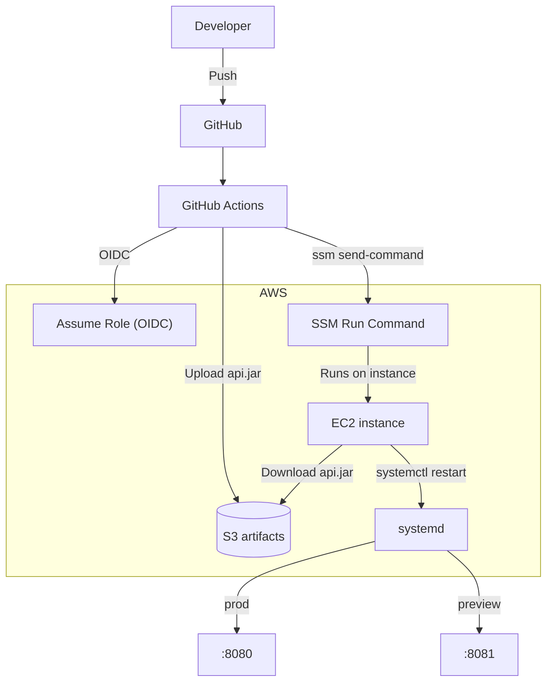

# 37기 SOPT 데모데이

37기 DIVE SOPT 데모데이 공식 웹사이트입니다.

## Monorepo 구조

- `apps/web`: Next.js (프론트엔드)
- `apps/api`: Spring Boot (백엔드)

## Architecture

### Runtime (high-level)

```mermaid
flowchart LR
  Dev["Developer"]
  U["User / Browser"]

  subgraph Tooling["UI Documentation"]
    SB["Storybook (local)"]
  end

  subgraph Vercel["Frontend (Vercel)"]
    Web["Next.js Web App"]
  end

  subgraph Backend["Backend (optional)"]
    API["Spring Boot API"]
    DB[(PostgreSQL)]
  end

  subgraph SaaS["Observability & Analytics"]
    Sentry["Sentry"]
    GA["Google Analytics"]
  end

  Dev -.->|Runs locally| SB
  SB -.->|Shared UI components| Web

  U -->|HTTPS| Web
  Web -->|HTTPS API (optional)| API
  API -->|SQL| DB

  Web -.->|Errors & Performance| Sentry
  Web -.->|Pageviews & Events| GA
```

### Deployment (API)


