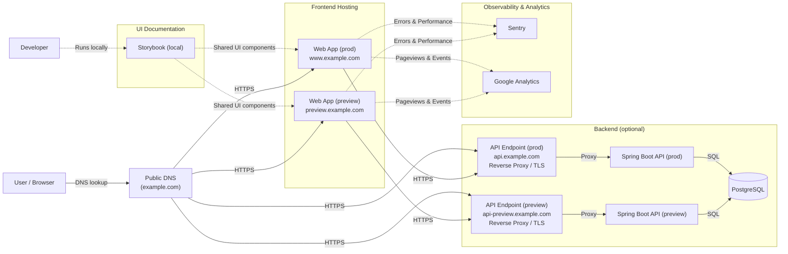
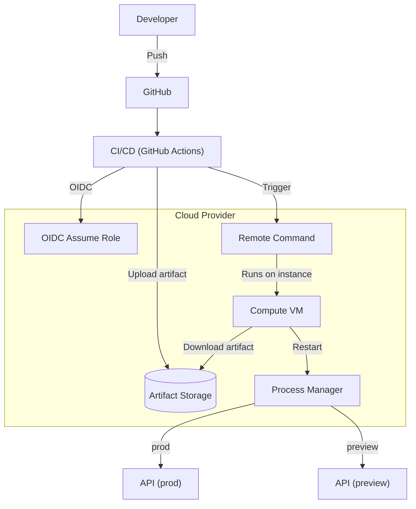

# 37기 SOPT 데모데이

37기 DIVE SOPT 데모데이 공식 웹사이트입니다.

## Monorepo 구조

- `apps/web`: Next.js (프론트엔드)
- `apps/api`: Spring Boot (백엔드)

## Tech Stack

### Frontend (`apps/web`)

| 역할                       | 종류                                                                                                                                                                                  |
| -------------------------- | ------------------------------------------------------------------------------------------------------------------------------------------------------------------------------------- |
| **`Framework`**            |                                                                               |
| **`Library`**              |                                                                                      |
| **`Programming Language`** |                                                                  |
| **`Styling`**              |                                                               |

### Backend (`apps/api`)

| 역할                       | 종류                                                                                                                                                  |
| -------------------------- | ----------------------------------------------------------------------------------------------------------------------------------------------------- |
| **`Framework`**            |                                  |
| **`Programming Language`** |                                                     |
| **`Build Tool`**           |                                                  |
| **`Database`**             |                                       |

### Tooling / Infra (Repo)

| 역할                  | 종류                                                                                                                                                                                                                                                              |
| --------------------- | ----------------------------------------------------------------------------------------------------------------------------------------------------------------------------------------------------------------------------------------------------------------- |
| **`Package Manager`** |                                                                                                                                                                 |
| **`Monorepo`**        |                                                                                                                                                    |
| **`Formatting`**      |                                           |
| **`CI`**              |                                                                                                                                    |
| **`Deployment`**      |                                                                                                                                                        |
| **`Local Infra`**     |                                                                                                                                                             |
| **`Version Control`** |                                                 |

## Architecture

### Runtime

### Deployment

