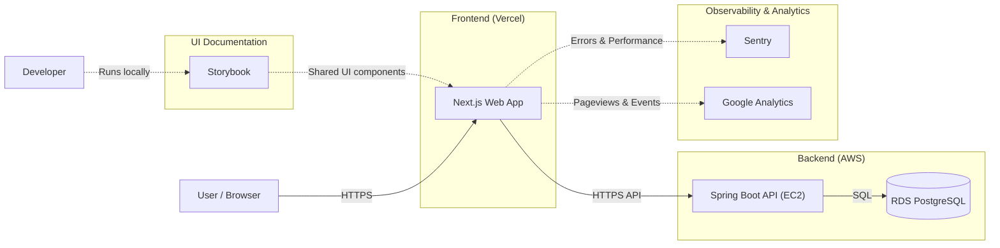

# 37기 SOPT 데모데이

37기 DIVE SOPT 데모데이 공식 웹사이트입니다.

## Monorepo 구조

- `apps/web`: Next.js (프론트엔드)
- `apps/api`: Spring Boot (백엔드)

## Architecture (High-level)

> This diagram is intentionally high-level (redacted) and focuses on request flow + UI documentation + observability/analytics.

## 로컬 실행

### 요구 사항

- Node.js + pnpm
- Java 21
- Docker (Postgres)

### 실행

0. Set required env vars:
   - `POSTGRES_PASSWORD=<local-password>`
   - `SPRING_DATASOURCE_PASSWORD=<same-as-POSTGRES_PASSWORD>`
1. Postgres 실행: `docker compose up -d`
2. 의존성 설치: `pnpm install`
3. 개발 서버 실행: `pnpm dev`

### 접속

- Web: `http://localhost:3000`
- API: `http://localhost:8080` (health: `/api/health`)
- Swagger UI: `http://localhost:8080/swagger-ui/index.html`
- Storybook: `http://localhost:6006` (run: `pnpm storybook`)

> `apps/web`는 로컬 개발 시 `/api/*` 요청을 `http://localhost:8080/api/*`로 프록시합니다.
