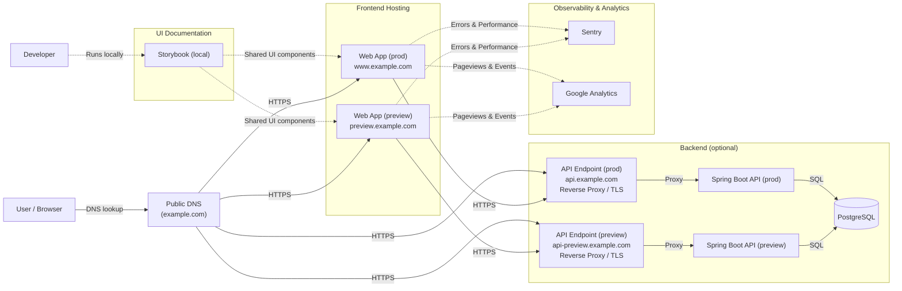
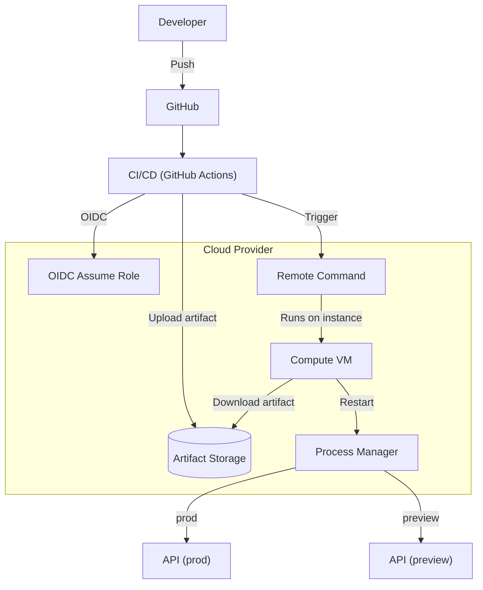

# 37기 SOPT 데모데이

37기 DIVE SOPT 데모데이 공식 웹사이트입니다.

## Monorepo 구조

- `apps/web`: Next.js (프론트엔드)
- `apps/api`: Spring Boot (백엔드)

## Architecture

### Runtime (concept-level, prod + preview)

### Deployment (API, optional)

> 본 문서의 도메인은 모두 예시(`example.com`)이며, 실제 운영 환경에서는 별도 도메인/인프라로 구성할 수 있습니다.

