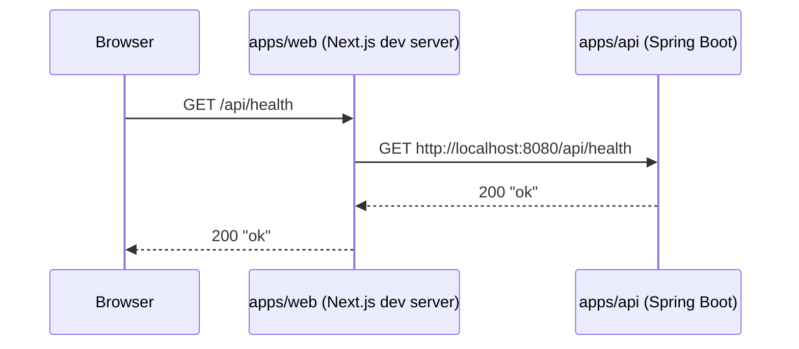

# System Overview

## What this system is

`SOPT-37th-DEMODAY` is the official website for the 37th DIVE SOPT Demo Day.

This repository is a monorepo with:

- `apps/web`: Next.js application (frontend)
- `apps/api`: Spring Boot application (backend API)
- Postgres: local DB via `docker-compose.yml` (used by `apps/api`)

## High-level container diagram

```mermaid
flowchart LR
  user[User Browser]
  web[apps/web\nNext.js]
  api[apps/api\nSpring Boot]
  db[(Postgres)]

  user --> web
  web -->|/api/* (dev proxy)| api
  api --> db
```

## Example request flow (local)

In development, `/api/*` is rewritten by the Next.js dev server (see `apps/web/next.config.ts`).



## Local ports (defaults)

- Web: `http://localhost:3000`
- API: `http://localhost:8080`
- DB: `localhost:5432` (via Docker)

## Key architectural constraints

- The web app is optimized for a fixed mobile width layout (see `apps/web/src/app/(tabs)/layout.tsx`).
- Observability is opt-in via environment variables (Sentry + GA; see `.env.example` and `apps/web/next.config.ts`).
