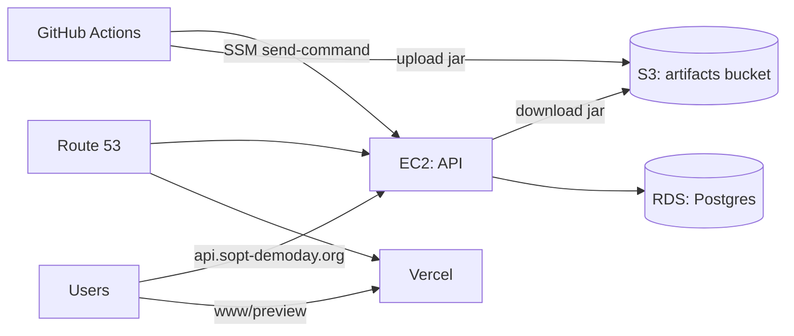

# AWS Infrastructure & Deployment

This document describes the **current** AWS infrastructure and deployment automation for this project.

Last verified: **2026-01-23 (UTC)** via AWS read-only API queries.

> This repo also deploys the web app via **Vercel**. This document covers Vercel only where it intersects with AWS (DNS).

## Scope

- AWS account: (redacted)
- Primary region: `ap-northeast-2` (Seoul)

> Note: This document intentionally redacts concrete infrastructure identifiers (account ID, resource IDs, public IPs,
> security group allowlists, and DB endpoints). Keep those values in a private runbook shared only with the ops team.

## High-level overview

- **Web (`apps/web`)**
  - Build/runtime: Vercel
  - DNS: Route 53 public hosted zone (`sopt-demoday.org.`)
- **API (`apps/api`)**
  - Runtime: EC2 single instance
  - DB: RDS Postgres (private)
  - Deployment: GitHub Actions → S3 (artifact) → SSM (remote command) → systemd restart

## DNS (Route 53)

Public hosted zone:

- Hosted zone: `sopt-demoday.org.` (hosted zone id: redacted)

Records (TTL: 60 seconds):

- `api.sopt-demoday.org` (`A`) → Elastic IP attached to the API EC2 instance
- `www.sopt-demoday.org` (`CNAME`) → Vercel DNS target (redacted)
- `preview.sopt-demoday.org` (`CNAME`) → Vercel DNS target (redacted)
- `sopt-demoday.org` (`A`) → external target (redacted)

## Network (VPC)

VPC:

- VPC: default VPC (`REDACTED_IP/16`)
- Internet gateway: attached (id redacted)
- Main route table: has `0.0.0.0/0 -> Internet Gateway`

Subnets:

- Default subnets in all AZs are used (RDS subnet group spans `ap-northeast-2a/b/c/d`)
- `MapPublicIpOnLaunch=true` on default subnets (public IP assigned by default to instances unless disabled)

Not present (as of 2026-01-23):

- NAT gateway: none
- VPC endpoints: none

## API runtime (EC2)

Instance:

- Name tag: `demoday-api-v2`
- Type: `t3.small`
- AZ: single AZ (redacted)
- Key pair: present (name redacted)
- IMDSv2 (instance metadata): `HttpTokens=required`

Elastic IP:

- Public IP: attached (value redacted)
- Allocation ID: redacted

Security group:

- SG: `demoday-api-ec2-sg` (id redacted)
- Inbound:
  - `tcp/80` (HTTP) open to the internet
  - `tcp/443` (HTTPS) open to the internet
  - `tcp/22` (SSH) restricted to a single `/32` allowlist (value redacted)
- Egress: allow all

Storage (root volume):

- Root volume: gp3, 8 GiB (id redacted)
- `DeleteOnTermination=true`
- `Encrypted=false`
- Account setting: `EbsEncryptionByDefault=false` (so new volumes are unencrypted unless explicitly enabled)

IAM instance profile:

- Instance profile: attached (name redacted)
- Role: attached (name redacted)
- Managed policies:
  - `AmazonSSMManagedInstanceCore`
  - `CloudWatchAgentServerPolicy`
- Inline policies:
  - Read 1 Secrets Manager secret for the RDS master password
  - Read artifacts from the S3 artifacts bucket (`api/*` prefix only)

## Database (RDS Postgres)

Instance:

- Identifier: `demoday-postgres` (id redacted)
- Engine: Postgres `17.6`
- Class: `db.t3.micro`
- Multi-AZ: `false` (single AZ)
- AZ: single AZ (redacted)
- Public access: `false`
- Endpoint: redacted (`:5432`)

Storage & safety:

- Storage: gp3, 20 GiB
- Storage encryption: enabled (KMS)
- Backups: retention `1` day
- Deletion protection: `false`

Security group:

- SG: `demoday-api-rds-sg` (id redacted)
- Inbound:
  - `tcp/5432` from `demoday-api-ec2-sg` only

## Artifacts bucket (S3)

Bucket (name redacted; configured via GitHub Actions variables):

- `DEMODAY_ARTIFACTS_S3_BUCKET`

Security:

- Public access block: enabled (all)
- Default encryption: SSE-S3 (`AES256`)
- Versioning: not enabled (no version status returned)

## Deploy pipeline (API → EC2)

The production deploy workflow is defined in:

- `.github/workflows/deploy-api.yml`

Trigger:

- `push` to `main` (only when `apps/api/**` or the workflow itself changes)
- `workflow_dispatch` (manual)

Authentication:

- GitHub Actions uses OIDC (OpenID Connect; **short-lived token-based login**) to assume:
  - Role ARN: `DEMODAY_DEPLOY_ROLE_ARN`
  - Trust is restricted to: `repo:maehwasoo/SOPT-37th-DEMODAY:ref:refs/heads/main`

Required GitHub Actions variables (repo-level):

- `DEMODAY_AWS_REGION` (example: `ap-northeast-2`)
- `DEMODAY_ARTIFACTS_S3_BUCKET` (artifacts bucket name)
- `DEMODAY_API_EC2_INSTANCE_ID` (target instance id)
- `DEMODAY_DEPLOY_ROLE_ARN` (OIDC assume role ARN)
- `DEMODAY_API_HEALTHCHECK_URL` (example: `https://api.sopt-demoday.org/api/health`)
- `DEMODAY_API_PREVIEW_HEALTHCHECK_URL` (optional; defaults to `https://api-preview.sopt-demoday.org/api/health`)

Where to configure:

- GitHub repository → Settings → Secrets and variables → Actions → Variables

Role permissions (current inline policy):

- S3:
  - `s3:PutObject` to the artifacts bucket (`api/*` prefix)
  - `s3:ListBucket` on the artifacts bucket (prefix-limited to `api/*`)
- SSM:
  - `ssm:SendCommand`, `ssm:GetCommandInvocation`, `ssm:ListCommandInvocations` (`Resource: "*"`)
- Debug:
  - `ec2:DescribeInstances` (`Resource: "*"`)

Actions (simplified):

1. Build API jar (`./gradlew bootJar -x test`)
2. Upload jar to S3:
   - `s3://${S3_BUCKET}/api/${GITHUB_SHA}/api.jar`
3. Deploy via SSM (runs on EC2):
   - Download jar to `/opt/demoday/api/api.jar`
   - `systemctl restart demoday-api`
4. Health check:
   - `https://api.sopt-demoday.org/api/health` expects `ok`

### Preview deploy (develop → api-preview)

Preview deploy is also automated via GitHub Actions:

- Workflow: `.github/workflows/deploy-api-preview.yml`
- Trigger: `push` to `develop` (API changes only) or manual (`workflow_dispatch`)
- Artifact path:
  - `s3://${S3_BUCKET}/api-preview/${GITHUB_SHA}/api.jar`
- Deploy (SSM on EC2):
  - Download jar to `/opt/demoday/api-preview/api.jar`
  - `systemctl restart demoday-api-preview`
- Health check:
  - `https://api-preview.sopt-demoday.org/api/health` expects `ok`

## Observability / audit

Current state (as of 2026-01-23):

- CloudWatch Logs log groups (prefix `demoday`): none found
- CloudTrail trails: none found

Non-AWS observability:

- Sentry / GA are configured at the app level (see `.env.example` and `docs/architecture/06-observability.md`).

## Cost estimate (rough)

This is a **public on-demand pricing** estimate (USD), excluding:

- data transfer (internet / cross-AZ)
- RDS backup storage beyond free allocation
- logs/metrics/alarms (currently minimal)

Current always-on components:

- EC2 `t3.small` (compute)
- RDS `db.t3.micro` (compute)
- Public IPv4 (Elastic IP)
- EBS gp3 8 GiB + RDS gp3 20 GiB (storage)
- Route 53 hosted zone

Rule of thumb:

- Fixed cost is roughly **~$0.065/hour** → **~$1.55/day** (24h)
- Rough monthly fixed cost is **~$47/month** (730h)

If you keep the infra running **until 2026-01-24**, your additional cost is approximately:

- `hours_until_shutdown × $0.065` (plus variable traffic-dependent costs)

## Risk checklist (docs-only)

If the goal is a short-lived demo-day system, the current setup is practical. If the goal is longer-term operation,
consider documenting and/or applying the following improvements (not done in this repo PR):

- **EBS root volume is unencrypted** (and encryption-by-default is off).
- **Single-instance / single-AZ** runtime (EC2 + RDS) → limited availability.
- **EC2 AZ != RDS AZ** → potential cross-AZ data transfer cost and latency.
- **SSH is enabled** (restricted to 1 IP) even though SSM exists → decide whether to keep SSH or fully migrate to SSM.
- **Backups are minimal** (1-day retention, deletion protection off) → acceptable for a demo, risky otherwise.
- **CloudTrail is off** → harder to audit changes.
